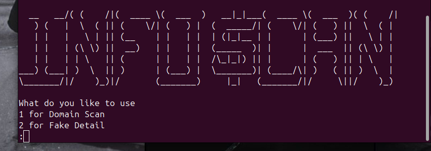

# InfoScan

Gather domain insights or generate fake data in seconds. Meet **InfoScan**—your ultimate recon assistant. 🚀

## Features



- Perform **domain reconnaissance** with `who.is`
- Generate **realistic fake data** using `faker`
- Lightweight and **easy to use**

## Installation & Usage

### Prerequisites
Ensure you have **Python 3** installed on your system.

### Setup on Linux (Ubuntu & Similar Distros)
Run the following commands in your terminal:

```bash
# Create a virtual environment
python3 -m venv myenv

# Activate the virtual environment
source myenv/bin/activate

# Install required dependencies
pip install python-whois faker

# Run InfoScan
python3 infoscan.py
```

## License
This project is **open-source**.

## Contribution
Feel free to contribute by submitting pull requests or reporting issues!

## Contact
https://linktr.ee/sovit.jung.rijal
https://linktr.ee/sovit.jung.rijal
